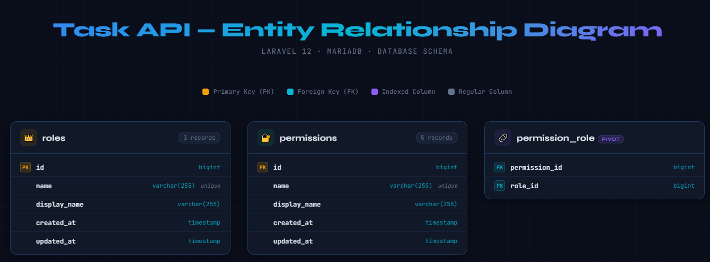
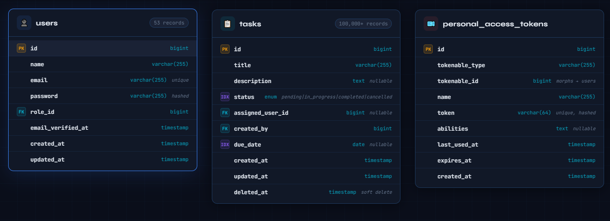
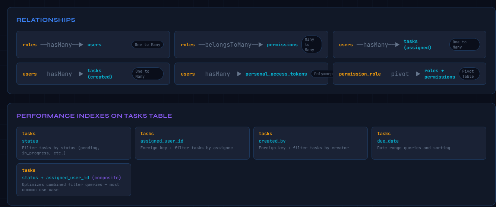
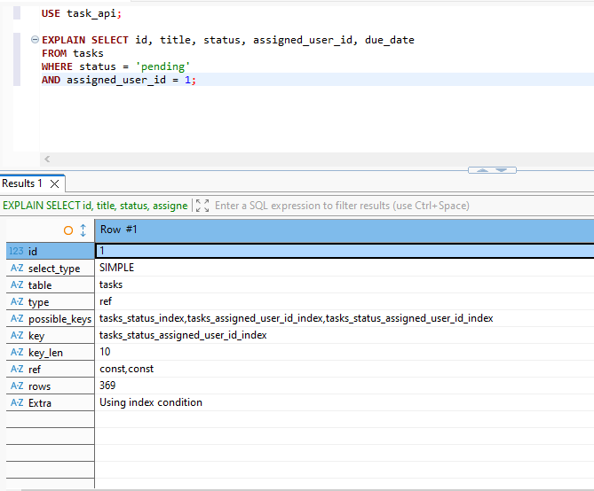

# Task Management API 🚀

A production-grade REST API built with Laravel 12 demonstrating advanced architecture, Redis caching, RBAC, and scalability best practices.

   

---

## Tech Stack

| Component | Technology |
|-----------|-----------|
| Framework | Laravel 12 |
| Language | PHP 8.3 |
| Authentication | Laravel Sanctum |
| Database | MariaDB 10.4 |
| Cache / Queue | Redis (Predis) |

---

## Setup Instructions

### Prerequisites
- PHP 8.3+
- Composer 2.x
- MariaDB or MySQL
- Redis server

### Installation

**1. Clone the repository**
```bash
git clone https://github.com/harshitha-swamy/task-api.git
cd task-api
```

**2. Install dependencies**
```bash
composer install
```

**3. Configure environment**
```bash
cp .env.example .env
php artisan key:generate
```

Edit `.env`:
```
DB_DATABASE=task_api
DB_USERNAME=root
DB_PASSWORD=yourpassword
REDIS_CLIENT=predis
CACHE_STORE=redis
QUEUE_CONNECTION=redis
```

**4. Run migrations and seeders**
```bash
php artisan migrate
php artisan db:seed
```

**5. Start the server**
```bash
php artisan serve
```

**6. Start queue worker**
```bash
php artisan queue:work redis --tries=3 --backoff=60
```

### Test Credentials

| Role | Email | Password |
|------|-------|----------|
| Admin | admin@taskapi.com | password |
| Manager | manager@taskapi.com | password |
| User | user@taskapi.com | password |

---

## Architecture

### Layer Structure
```
Controllers  →  Form Requests (validation)
     ↓
Services     →  Business logic
     ↓
Repositories →  Database queries
     ↓
Models       →  Eloquent ORM
```

### Project Structure
```
app/
  Http/
    Controllers/Auth/     — AuthController
    Controllers/Task/     — TaskController
    Requests/             — LoginRequest, StoreTaskRequest, etc.
    Resources/            — UserResource, TaskResource
    Middleware/           — CheckPermission
  Models/                 — User, Task, Role, Permission
  Services/               — AuthService, TaskService, PermissionService
  Repositories/           — TaskRepository, TaskRepositoryInterface
  Jobs/                   — SendTaskAssignedNotification
database/
  migrations/             — All table definitions with indexes
  seeders/                — Role, Permission, User, Task seeders
routes/
  api.php                 — All versioned API routes (/api/v1/)
```

---

## API Endpoints

### Authentication

| Method | Endpoint | Description | Auth |
|--------|----------|-------------|------|
| POST | /api/v1/register | Register new user | No |
| POST | /api/v1/login | Login and get token | No |
| POST | /api/v1/logout | Invalidate token | Yes |

### Tasks

| Method | Endpoint | Description | Auth |
|--------|----------|-------------|------|
| GET | /api/v1/tasks | List tasks (paginated) | Yes |
| POST | /api/v1/tasks | Create task | Yes |
| GET | /api/v1/tasks/{id} | Get single task | Yes |
| PUT | /api/v1/tasks/{id} | Update task | Yes |
| DELETE | /api/v1/tasks/{id} | Delete task | Yes |
| GET | /api/v1/dashboard | Dashboard stats | Yes |

### Filtering
```
GET /api/v1/tasks?status=pending
GET /api/v1/tasks?assigned_user_id=1
GET /api/v1/tasks?per_page=50
```

**Default: 25 per page | Maximum: 100 per page**

---

## RBAC — Role Based Access Control

| Role | Permissions |
|------|-------------|
| Admin | All permissions |
| Manager | view_all, create, manage_all tasks |
| User | Create own tasks only |

- Permissions stored in database — never hardcoded
- Cached in Redis with 1 hour TTL
- Cache invalidated when permissions change

---

## Caching Strategy

| Data | Cache Key | TTL | Invalidated When |
|------|-----------|-----|-----------------|
| User Permissions | user_permissions_{id} | 1 hour | Role changes |
| Dashboard Stats | dashboard_stats_{id} | 5 minutes | Task mutations |

---

## Performance Optimizations

- **Eager Loading** — `with(['assignedUser', 'creator'])` prevents N+1 queries
- **Selective Columns** — `select()` used instead of `SELECT *`
- **Indexes** — status, assigned_user_id, due_date, composite index
- **Pagination** — enforced on all list endpoints (max 100)
- **Bulk Inserts** — seeder uses 1,000 record batches
- **Redis Caching** — permissions and stats served from memory

### Database Indexes

| Column(s) | Type | Purpose |
|-----------|------|---------|
| status | Single | Filter by status |
| assigned_user_id | Single | Foreign key + filter |
| due_date | Single | Date range queries |
| status + assigned_user_id | Composite | Combined filters |

---

## Background Job

**SendTaskAssignedNotification**

| Property | Value |
|----------|-------|
| Queue | Redis |
| Delay | 5 seconds |
| Max Retries | 3 |
| Backoff | 60 seconds |

Triggered automatically when a task is assigned or reassigned.

---

## Security

- Sanctum stateless token authentication
- FormRequest validation on all inputs
- Mass assignment protection via `$fillable`
- Rate limiting: 60 requests/minute
- Users isolated to their own tasks unless permitted
- Soft deletes — data never permanently lost

---

## Scaling to 1 Million Users

### Horizontal Scaling
- Multiple Laravel instances behind a load balancer
- Shared Redis cluster — stateless app servers
- Database read replicas for SELECT queries

### Database Scaling
- Connection pooling with ProxySQL
- Table partitioning by status or date
- Archive old completed tasks to cold storage

### Cache Scaling
- Redis Cluster with replication
- Increase permission TTL as traffic grows
- CDN for any public endpoints

### Queue Scaling
- Multiple workers on dedicated servers
- Laravel Horizon for monitoring and autoscaling
- Priority queues for critical jobs

### Observability
- Laravel Telescope for debugging
- APM monitoring (Datadog / New Relic)
- Slow query log monitoring
- Alerting on queue depth and failed jobs

---

## Screenshots

### ER Diagram




### Query EXPLAIN Analysis


---

## Postman Collection

Import `task-api-postman.json` into Postman to test all endpoints.